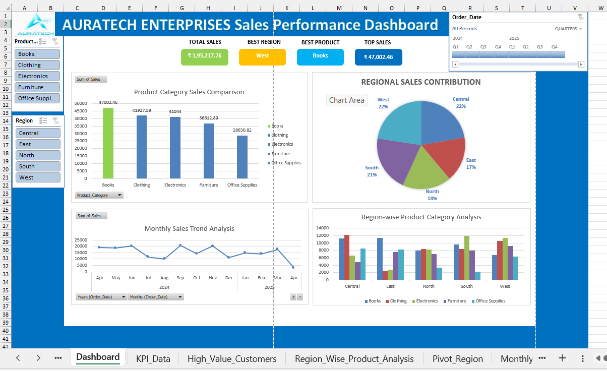

# 📊 AURATECH ENTERPRISES Sales Performance Dashboard

An interactive Excel dashboard project focused on sales analysis, KPI tracking, and business intelligence visualization using Pivot Tables, Charts, and Slicers.

## 📌 About This Project
This repository contains:
- Interactive sales dashboard
- KPI performance tracking
- Regional sales analysis
- Product category comparison
- Monthly sales trend visualization
- Pivot Table and Pivot Chart analysis
- Dynamic slicer filtering

## 📂 Files Included
- `Project2_Analyzer.xlsx` → Excel dashboard project file
- `Project2_Analyzer_Output.png` → Dashboard output screenshot

## 🛠 Technologies Used
- Microsoft Excel
- Pivot Tables
- Pivot Charts
- Slicers
- Data Visualization Techniques

## 🎯 Dashboard Features
This dashboard helps in understanding:
- Total sales performance
- Best-selling product category
- Regional sales contribution
- Monthly sales trends
- KPI analysis
- Interactive filtering and reporting

## 📈 Key Insights
- West region achieved the highest sales contribution
- Books category generated the highest sales
- Interactive slicers allow dynamic dashboard filtering
- Monthly sales trends help identify performance patterns

## 📸 Dashboard Preview

## 👨‍💻 Author
**Yashraj Sharma**

---
⭐ If you like this project, don't forget to star the repository.
